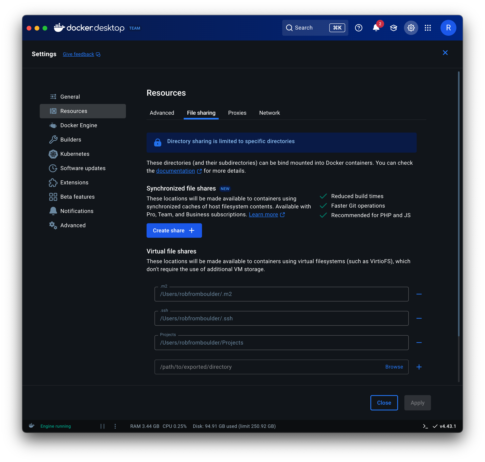

# Tugboat
Docker [utility container](https://www.thefullstackjunkie.com/blog/docker-utility-container) for Graylog plugin development

This container provides the **right versions** of `graylog-project`, `javac` and `mvn` utilities for Graylog 6.3 plugin development,
without dedicating your workstation to this purpose. This container is not designed to run as a server or daemon -- instead it executes a
single command (using the current working directory) and then stops and removes itself.

[](https://www.codefactor.io/repository/github/robfromboulder/tugboat)
[](https://github.com/robfromboulder/tugboat/blob/v6.3.x/CONTRIBUTING.md)


## System Requirements

* Docker Desktop for Windows (Intel 64-bit CPU, WSL 2 recommended)
* Docker Desktop for Mac (Apple Silicon or Intel)
* Docker for Linux (ARM 64-bit CPU or Intel 64-bit CPU)


## Installing Tugboat

Define a bash/zsh alias:
```bash
alias tugboat='docker run -v $(pwd):/root/work -v $HOME/.m2:/root/.m2 -v $HOME/.ssh:/root/.ssh --rm -it robfromboulder/tugboat:6.3.0e'
```
👆 Add this to `~/.bashrc` or `~/.zshrc` if you use tugboat frequently. This command maps the current working directory into the tugboat container, while using your existing SSH keys for authentication and Maven cache to minimize downloads.

⚠️ When using Docker Desktop on Mac, add virtual file shares for your project directories, maven cache, and SSH keys, or tugboat will fail to run.
<p></p>


## Using Tugboat

Use Graylog CLI:
```bash
tugboat graylog-project version
```

Use javac:
```bash
tugboat javac --version
```

Use maven:
```bash
tugboat mvn --version
```

Use python:
```bash
tugboat python3 --version
```

Use ssh:
```bash
tugboat ssh -V
```

Use bash to run commands interactively:
```bash
tugboat bash
```

Use bash to run a single command:
```bash
tugboat bash -c "pwd"
```


# Tugboat Limitations

* Only the current working directory and its children are available to a tugboat session. Any script that uses `cd ..` to go parent directories will end up in the container's root directories, instead of the parent directory on the host. The best workaround is to start tugboat from a common parent directory and then use `tugboat bash -c "cd blah && ..."` to move down into child directories.  